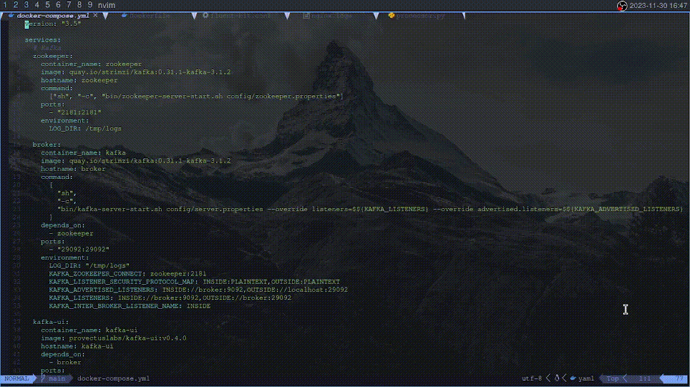
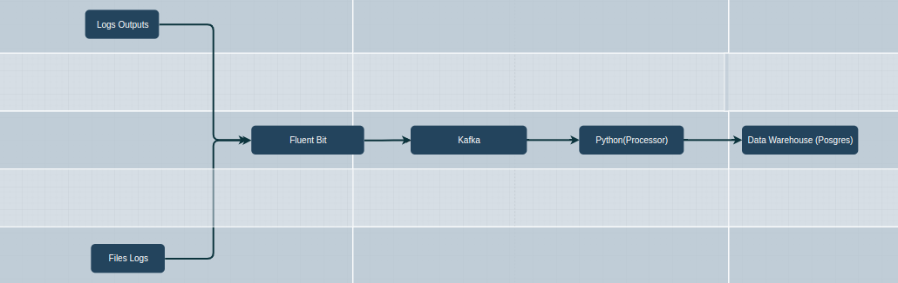

# <div align="center">Fluent Bit, Kafka, Postgres, and Python Pipeline</div>

En el contexto de la implementación del sistema, se presenta el diagrama de la canalización (pipeline) correspondiente al proceso de Fluent Bit. Se muestra el encarpetado:



Esta representación visual ofrece una visión detallada del flujo de datos y los procesos asociados con Fluent Bit en la arquitectura actual.

---

## - Estructura del Directorio

- **docker-compose.yml**
- **fluentbit**
  - Dockerfile
  - fluent-bit.conf
  - nginx.logs
  - parser.conf
- **package.json**
- **package-lock.json**
- **python**
  - package.json
  - package-lock.json
  - processor.py
  - requirements.ext
- **README.md**
- **src**
  - pipeline_kafka.gif

---

## Diagrama del Pipeline



---

## Configuraciones y Dependencias

### Docker Compose

El archivo `docker-compose.yml` define la configuración del entorno Docker para la ejecución del pipeline.

### Fluent Bit

La carpeta `fluentbit` contiene archivos esenciales para la configuración de Fluent Bit, como el Dockerfile, `fluent-bit.conf`, `nginx.logs`, y `parser.conf`.

### Python

La carpeta `python` contiene archivos relacionados con el procesamiento en Python, incluyendo `processor.py` y `requirements.ext`.

### Dependencias

- **package.json y package-lock.json:** Archivos relacionados con la configuración y dependencias del proyecto.
- **README.md:** Documentación general del proyecto.

---

## Instrucciones de Implementación

Para implementar el pipeline, sigue estos pasos:

1. Asegúrate de que las dependencias del proyecto estén instaladas utilizando los archivos `package.json` y `requirements.ext`.

```bash
# Comando de ejemplo
pip install requirements | npm ci
```

2. Ejecuta el archivo `docker-compose.yml` utilizando Docker.

```bash
sudo docker-compose up --build -d # si queres ver los logs saca el argumento -d
```

3. Creamos el topico de Kafka en el cual se almacenara

```bash
sudo docker exec -it kafka /bin/bash docker-compose up --build -d # si queres ver los logs saca el argumento -d
```

4. Atraves del contenedor de Fluent-bit enviamos los logs al topico de Kafka

```bash
sudo docker exec -it fluent-bit /bin/bash /opt/fluent-bit/bin/fluent-bit -c ./fluent-bit.conf -R ./parser.conf
```

5. Creo y configuro nuestro Data warehouse.

```bash
sudo docker exec -it posgres /bin/bash psql -U fluentbit -d fluentbit
```

```bash
DROP TABLE IF EXIST test.kpis;

CREATE IF NOT EXIST SCHEMA test;

CREATE TABLE IF NOT EXIST test.kpis (
  kpi_key VARCHAR(100) NOT NULL,
  kpi_value BIGINT NOT NULL,
  vcount INTEGER NOT NULL,
  PRIMARY KEY ( kpi_key, kpi_value )
);
```

6. Por ultimo, procesamos los datos del topico de kafka y los ingresamos a nuestro Data warehouse atraves de python.

```bash
python processor.py
```
